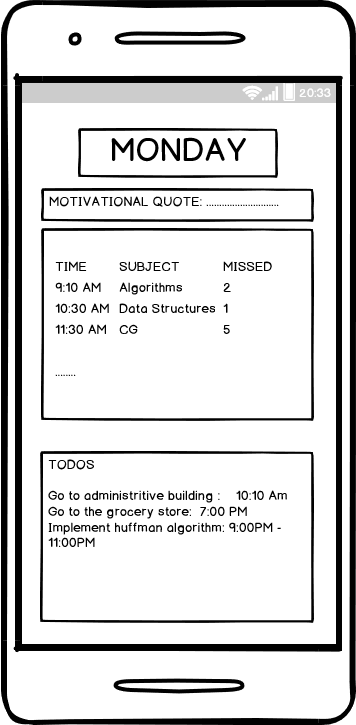

# in_time
[](https://gitter.im/in_time/Lobby)

### Note: The project is in its very initial stage

#### A cross platform mobile application to be always in time.
The app will help students to get all the work done in time and track his activities
The students will be notified about their timetable, classes to attend, other todos to be done.
It will help the student keep track of the number of class he/she has missed.
It will also show motiviational quotes with todos to be done so that the student stays motivated.



## Architecture used:
 [Bloc Pattern](https://medium.com/flutterpub/architecting-your-flutter-project-bd04e144a8f1)


## Contributing Guide:

### Step 1: Fork it.
Fork the repository by clicking on the <a href="https://github.com/nityanandagohain/in-time/new/master?readme=1#fork-destination-box"><kbd><b>Fork</b></kbd></a> button.

### Step 2: Clone it.
Clone your copy of the repository onto your local machine.   

```sh
git clone https://github.com/<YOUR_USERNAME>/in-time
```

> This makes a local copy of the repository onto your machine

### Step 3: Add Upstream Remote.
List the current configured remote repository for your fork.
```sh
git remote -v
origin  https://github.com/Your_Username/in-time.git (fetch)
origin  https://github.com/Your_Username/in-time.git (push)
```
Specify a new remote upstream repository that will be synced with the fork.
```sh
git remote add upstream https://github.com/nityanandagohain/in-time
```
Verify the new upstream repository you've specified for your fork.
```sh
origin  https://github.com/Your_Username/in-time (fetch)
origin  https://github.com/Your_Username/in-time (push)
upstream        https://github.com/nityanandagohain/in-time (fetch)
upstream        https://github.com/nityanandagohain/in-time (push)
```
### Step 4: Make Firebase Project.
* Go to [Firebase Console](https://console.firebase.google.com/)  
* Click on Add Project   
* Add name, accept the terms and click on Create Project  
* Go to 'Add Firebase to your Android App'  
    * Enter Package name as `com.example.in_time`
    * Add your SHA-1 key (click on the question mark near it and follow the steps to find your SHA-1 key)
    * Download Config file `google.services.json`
    * Follow the rest of the steps
* Run the app by typing `flutter run` onto your terminal

### Step 5: Contributing...
Whenever contributing, create a separate branch using commands below. Keep your master branch synced with remote branch.

* This will create a new branch
```sh
git branch Branch_Name
```
* Switch to the new branch
```sh
git checkout Branch_Name
```
* Add your changes to the branch
```sh
git add .
```
* Add an explanation to the contribution while committing
```sh
git commit -m "relevant explanation"
```
* Push it onto your remote repository
```sh
git push -u origin Branch_Name
```
* Go to your repository in browser and click on 'Compare and Pull Requests'. 
* Add title and description to your contribution!

## Demo Gif of Working App

<a href="https://imgflip.com/gif/2pr4zr"></a>


